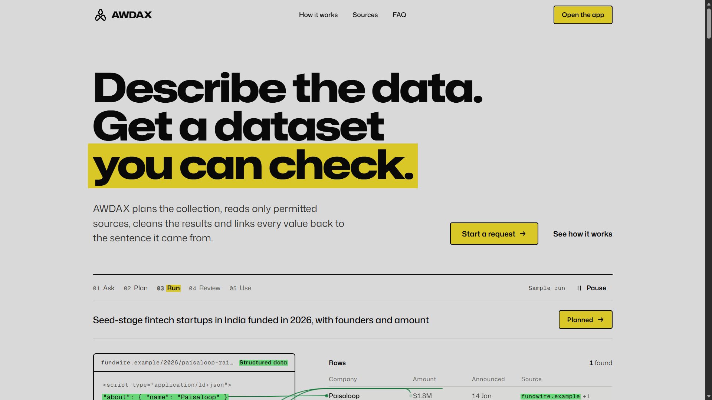
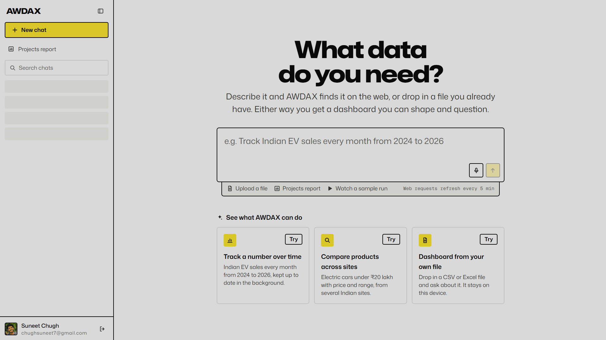

# AWDAX

<div align="center">
  <b>Ask for data. See where it came from. Explore it your way.</b>
</div>
<br>

<div align="center">
  
</div>

## What it is

AWDAX turns a plain-language request into a structured dataset. It researches the web the way a person would, shows its discovery live,
and gives you an interactive dashboard to inspect the sources, chart the rows, ask follow-up questions and export the result. It also reads
your own files, and it can be driven from code (an API with per-account keys) and from Claude (an MCP server).

<div align="center">
  
</div>

## What you can do

- **Research the web with a request.** "Electric vehicles in India with prices and range", "parliamentary debates in India between 2010 and 2025".
  A research step searches Google and ranks the best websites; they are tried first, then more searches fill the gaps.
- **Find local businesses and leads.** Requests about shops, clinics, restaurants, agencies or "leads near me" use Google Maps (Places API),
  tile a city or region, and score each business as a lead. The business's own website can be read for contact details.
- **Read what pages hide.** A table built by JavaScript is read from the data feed behind it, page after page; a page with a pager but no feed is
  read through the browser's accessibility tree and its "Next" button is pressed; data files a site offers (CSV, XLSX, JSON) are downloaded,
  read, stored and deleted. Every link first gets a plain web request, and the ones that fail are kept as a list of failed links.
- **Respect the request's limits.** A period in the request ("between 2010 and 2025", "since 2015") is enforced on every row.
- **Watch it live.** Sources appear as they are found; pausing or deleting a chat stops its work and frees its slot, and runs past the limit
  wait in line instead of being refused.
- **Explore the data.** Report, Data, Graphs and Sources views; charts chosen from the data; export as CSV, Excel, JSON, SQL, TSV, XML, Markdown or
  JSON Lines.
- **Ask questions about the rows.** Totals, averages, rankings, percentages and comparisons are computed exactly (decimal arithmetic) from the
  current table without scraping again.
- **Bring your own data.** Upload a CSV, TSV, JSON or `.xlsx` file; it stays in your browser.
- **Use it from code and from Claude.** Per-account API keys (`awx_...`), an OpenAPI description at `/api/openapi.json`, and an MCP endpoint at
  `/api/mcp` (docs/MCP.md). Every account only ever sees its own chats.

## How it works, in one paragraph

A request is turned into an intent (topic, place, period, fields) and routed: Google Maps for places, the eGazette pipeline for gazette notices,
the general pipeline for everything else. The general pipeline researches websites, inspects each one in a single browser visit, scrapes it by the
best route it offers (data feed, data file, accessibility tree, or the page's HTML), stores the rows, merges duplicates across sources, and
streams progress to the browser. docs/ARCHITECTURE.md has the details.

## Quick start (local)

```bash
# backend (Python 3.12 or newer, Chrome installed)
python -m venv .venv && .venv/Scripts/pip install -r requirements.txt     # Linux/macOS: .venv/bin/pip
cp .env.example .env                                                       # then set GEMINI_API_KEY, SUPABASE_URL, API_KEY_PEPPER
.venv/Scripts/python app.py                                                # http://127.0.0.1:8000

# frontend (Node 24), in another terminal
cd Frontend && npm ci && npm run dev                                       # http://localhost:5173/app
```

Sign-in uses Supabase (Google). To try the app without signing in, put `AWDAX_AUTH_MODE=dev` in `.env` and run `npm run dev:agent` instead.
LOCAL_DEV.md has the details and the troubleshooting list.

## Tests

```bash
# backend: ~540 tests, no network or browser needed
python -m unittest discover -s tests/test_awdax_api -t tests/test_awdax_api
python -m unittest discover -s tests -t tests -p "test_*.py"

# frontend, from Frontend/
npm run lint && npm test && npm run build
```

Continuous integration (`.github/workflows/ci.yml`) runs all of this, plus a lint for unused code, a boot check of the production server and a
build of both Docker images, on every pull request.

## Deploying

The site and the backend run from one domain: Docker Compose starts the backend (gunicorn with Chromium), the MCP endpoint and Caddy, which
serves the site and handles HTTPS. **docs/DEPLOY.md** is the step-by-step guide (server, DNS, Supabase and Google settings, first start, updates,
backups, troubleshooting); `.github/workflows/deploy.yml` can run the update from GitHub.

## Documentation

| | |
|---|---|
| docs/DEPLOY.md | Putting it on a server |
| docs/CONFIGURATION.md | Every setting and what it does |
| docs/ARCHITECTURE.md | The pipeline, the modules, the data model |
| docs/MCP.md | Connecting Claude |
| LOCAL_DEV.md | Running it on your machine |
| docs/AX_TREE_EXPERIMENT.md | Measurements behind reading pages through the accessibility tree |
| Frontend/docs/ | Frontend notes (app behaviour, connecting the backend) |
| docs/audit/, docs/archive/ | Earlier audits and status notes; kept as history, not instructions |
| AGENTS.md | Rules for people and tools working on the repository |
